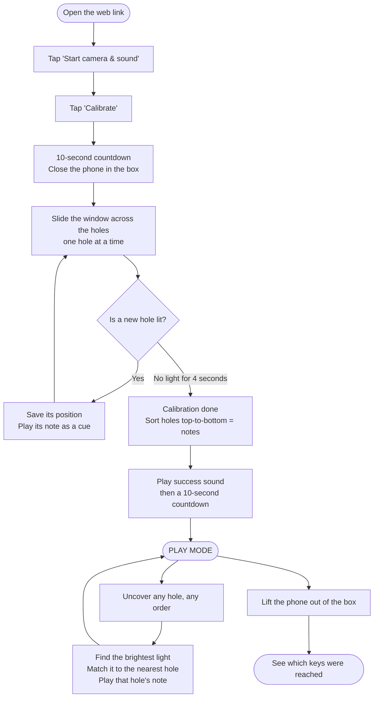

# Optical Piano

A light-powered plywood piano for kids. The phone sits inside a dark box, camera facing the lid. Each piano key uncovers a small hole in the lid; the camera sees which hole lets light in and plays the matching note. No electronics and no wiring — the phone is the sensor, the computer, and the speaker all at once.

This repo is the whole web app (a PWA). Open it on a phone over HTTPS, tap **Start camera & sound**, then **Calibrate**. Everything runs on the phone; no video ever leaves the device, and it works offline once loaded.

---

## Table of contents

- [How you use it](#how-you-use-it)
- [The flow at a glance](#the-flow-at-a-glance)
- [How it works (in plain English)](#how-it-works-in-plain-english)
  - [What the camera actually sees](#what-the-camera-actually-sees)
  - [The tricky part: the camera keeps changing the brightness](#the-tricky-part-the-camera-keeps-changing-the-brightness)
  - ["Find the light, then name it"](#find-the-light-then-name-it)
  - [Calibration: learning where the holes are](#calibration-learning-where-the-holes-are)
  - [Keeping notes steady](#keeping-notes-steady)
  - [The Sensitivity slider](#the-sensitivity-slider)
  - [The "Show detection" overlay](#the-show-detection-overlay)
- [Files](#files)
- [Hosting](#hosting)

---

## How you use it

1. **Start camera & sound** — pick the camera, grant permission.
2. **Calibrate** — a countdown gives you time to close the phone in the box. Then, with the box shut, you **slowly slide the window across all the holes, one at a time**. You'll hear a note for each hole it finds (an ascending run), and a little tune when it's done.
3. **Play** — uncover holes in any order; each one sounds its own note.

You never need to see the screen — all the cues are audible, because the phone is hidden inside the box.

---

## The flow at a glance

Read it top to bottom. Each box is one step.

**Step by step, in one line each:**

1. **Open** — scan the QR code or open the link. It works offline after the first load.
2. **Start** — tap *Start camera & sound*. This turns on the camera and the sound.
3. **Calibrate** — tap *Calibrate*. A 10-second countdown begins.
4. **Close the box** — put the phone inside and shut it before the countdown ends.
5. **Sweep** — slowly slide the light window across every hole, one at a time.
6. **Learn** — for each hole it finds, the app saves its spot and plays its note.
7. **Finish** — stop sweeping. After 4 quiet seconds, calibration ends by itself.
8. **Get ready** — a success sound plays, then a 10-second countdown to play mode.
9. **Play** — uncover holes in any order. Each one plays its own note.
10. **Done** — lift the phone out to see which keys were reached.

---

## How it works (in plain English)

### What the camera actually sees

Inside the closed box it's **not** pure black. The phone's camera automatically brightens dark scenes, so the lid looks **grey**, and the closed holes look like **dark spots** on that grey. When a hole is uncovered, a shaft of light comes through and that spot turns **bright white** — much brighter than anything else in the picture.

So there are really three shades:

| What it is | How bright it looks |
|---|---|
| A closed hole (dark spot) | darkest |
| The lid (background) | medium grey |
| An **open** hole (light coming in) | brightest — nearly pure white |

### The tricky part: the camera keeps changing the brightness

Phone cameras constantly re-adjust their own brightness ("auto-exposure"). As holes open and close, the whole picture gets a little lighter or darker on its own. That means you **can't** just say "anything brighter than X is a lit hole" — X keeps moving.

The trick the app uses: instead of a fixed brightness level, it compares the **brightest spot** in each frame against **that same frame's own average brightness**. An open hole is always dramatically brighter than its surroundings, no matter how the camera has adjusted itself. This makes the detection immune to the camera's brightness drift.

### "Find the light, then name it"

The core idea is simple, and it relies on one assumption:

> **Assumption:** only **one hole is ever open at a time** (a single sliding window uncovers one hole).

Because of that, every frame the app just:

1. **Finds the single brightest spot** in the picture.
2. **Checks it's really a lit hole** — it must be near-white *and* clearly brighter than the frame's own background. (This ignores the dim, blurry in-between moments when the window is sliding between holes.)
3. **Figures out which hole it is** by looking at *where* the bright spot is and matching it to the nearest hole learned during calibration.
4. **Plays that hole's note**, and keeps it sounding as long as the hole stays open (a "hold").

Taking only the single brightest spot also means the glow that spills around a bright hole can't accidentally trigger a neighbour — only the true centre wins.

### Calibration: learning where the holes are

Calibration's only job is to learn the **position** of each hole. Instead of asking you to press keys one by one (which failed when you slide the window continuously), it now watches while you **sweep** the window across all the holes:

- Every moment a hole is lit, it notes **where** the light is.
- Nearby sightings are grouped together into one hole (so revisiting a hole doesn't create a duplicate); a genuinely new position becomes a new hole, and you hear its note.
- When you stop sweeping and it's been quiet for a few seconds, it finishes automatically: it lines the holes up **top-to-bottom** and assigns them notes in order (top hole = lowest note), then plays them back so you can hear the mapping.

### Keeping notes steady

Two small touches keep it from stuttering:

- **Hold:** once a hole's note starts, it keeps playing until a *different* hole (or silence) is clearly detected.
- **Debounce:** a change has to persist for a couple of frames before the note switches, so a single noisy frame can't cause a blip.

### The Sensitivity slider

Sensitivity works like a camera's light-gain (ISO) dial. Turning it up **brightens the live picture on screen** *and* makes the "is this a lit hole?" test easier to trip; turning it down does the opposite. What you see getting brighter is exactly what makes notes easier to trigger.

### The "Show detection" overlay

A toggle (on by default) draws, on top of the live video, exactly what the detector is thinking:

- a **red patch** over the pixels it currently counts as "lit,"
- a **green crosshair** at the centre of that light,
- the **hole box** it snapped to, and
- a live readout like `lit • gap 120 • E4` (or `silence` between holes).

It's a diagnostic view only — it's never saved into the recorded footage or photos.

---

## Files

- `index.html` — the entire app: camera capture, calibration, light detection, and the Web Audio synth. Organised into numbered sections (constants, state, audio, camera, pixels, calibration, play detection, render, main loop, wiring).
- `sw.js` — service worker for offline use. Its cache name is version-bumped on every change so phones pick up the new version.
- `manifest.webmanifest`, `icon-*.png` — installable PWA metadata.

## Hosting

Served with GitHub Pages: **Settings → Pages → Deploy from branch → `main` / root**. Must be HTTPS, because the camera and microphone permissions require a secure origin.
